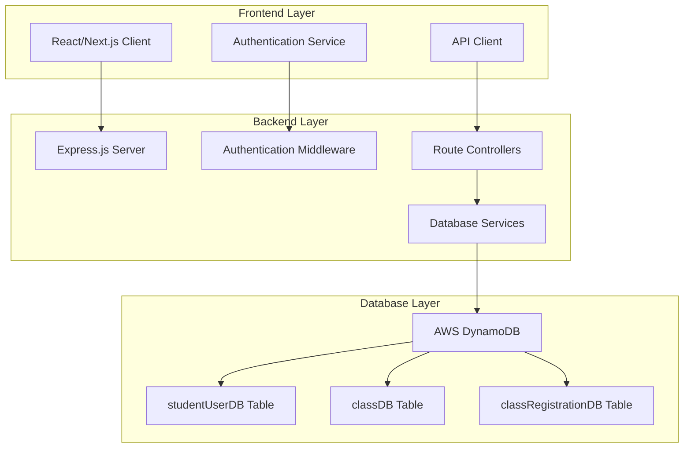
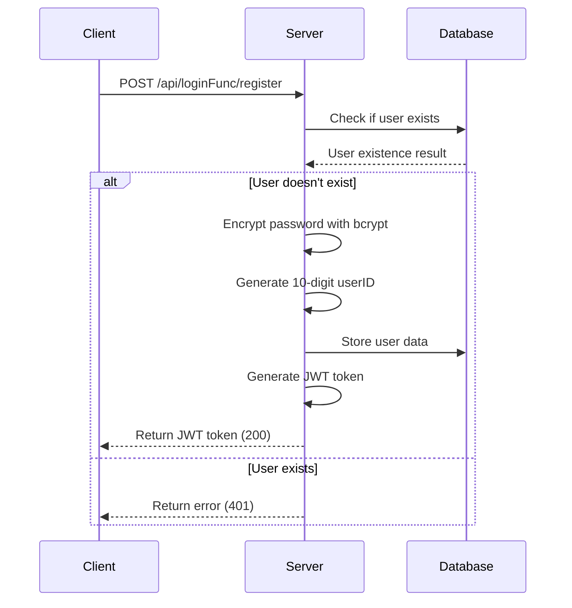
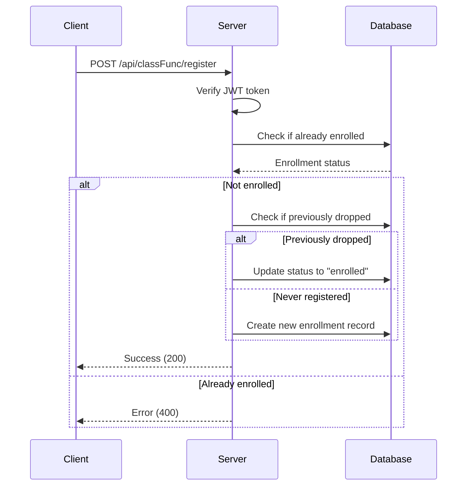

# Design Document

## Overview

The Class Registration System is a full-stack web application that enables students to register for courses, manage their enrollments, and view class information. The system follows a three-tier architecture with a React/Next.js frontend, Express.js backend API, and AWS DynamoDB database layer.

## Architecture

### High-Level Architecture



### Technology Stack

- **Frontend**: React.js with Next.js framework
- **Backend**: Node.js with Express.js framework
- **Database**: AWS DynamoDB with AWS SDK v3
- **Authentication**: JWT (JSON Web Tokens)
- **Password Security**: bcrypt for encryption
- **Development Tools**: nodemon for development server

## Components and Interfaces

### Database Schema

#### studentUserDB Table
```javascript
{
  userID: Number,        // Primary Key - 10-digit unique identifier
  username: String,      // Unique username
  fullName: String,      // Student's full name
  email: String,         // Unique email address
  password: String       // bcrypt encrypted password
}
```

#### classDB Table
```javascript
{
  classId: String,       // Primary Key - Format: "IFT 593", "CSE 201"
  className: String,     // Course name
  credits: Number,       // 3 or 4 credits only
  description: String    // Course description
}
```

#### classRegistrationDB Table
```javascript
{
  classId: String,       // Foreign Key from classDB
  userID: Number,        // Foreign Key from studentUserDB
  className: String,     // Foreign Key from classDB
  registrationStatus: String // "enrolled" or "dropped"
}
```

### Backend API Endpoints

#### Authentication Routes (`/api/loginFunc/`)
- `POST /register` - Student registration
- `POST /login` - Student login
- `POST /logout` - Student logout

#### Class Management Routes (`/api/classFunc/`)
- `GET /available` - Get available classes for student
- `GET /enrolled` - Get student's enrolled classes
- `GET /dropped` - Get student's dropped classes
- `POST /register` - Register for a class
- `POST /deregister` - Drop a class

### Frontend Components

#### Pages
- **Login Page** - Username/email and password authentication
- **Registration Page** - New student account creation
- **Dashboard** - Main interface with navigation tabs

#### Navigation Components
- **Available Classes Tab** - Display enrollable courses
- **My Classes Tab** - Show enrolled courses with unenroll buttons
- **Dropped Classes Tab** - Show dropped courses with re-enroll buttons

#### Form Components
- **Login Form** - Authentication form with validation
- **Registration Form** - Account creation with password strength validation
- **Class Action Buttons** - Enroll/Unenroll/Re-enroll functionality

## Data Models

### User Authentication Flow


### Class Registration Flow


## Error Handling

### HTTP Status Codes
- **200 OK** - Successful operation
- **400 Bad Request** - Invalid request or business logic error
- **401 Unauthorized** - Authentication failed or user already exists
- **404 Not Found** - Resource not found (user, class, etc.)
- **500 Internal Server Error** - Server-side errors

### Error Response Format
```javascript
{
  success: false,
  message: "Error description",
  code: "ERROR_CODE"
}
```

### Success Response Format
```javascript
{
  success: true,
  data: {...},
  token: "jwt_token" // Only for authentication endpoints
}
```

## Testing Strategy

### Database Layer Testing
- **Unit Tests**: Test individual database functions (createDatabase, userExistsInDB, etc.)
- **Integration Tests**: Test database operations with actual DynamoDB tables
- **Data Validation**: Verify data integrity and constraint enforcement

### Backend API Testing
- **Route Testing**: Test all API endpoints with various input scenarios
- **Authentication Testing**: Verify JWT token generation and validation
- **Middleware Testing**: Test authentication middleware and request logging
- **Error Handling**: Test error responses for invalid inputs and edge cases

### Frontend Testing
- **Component Testing**: Test individual React components
- **Form Validation**: Test password strength and email validation
- **API Integration**: Test frontend-backend communication
- **User Flow Testing**: Test complete user journeys (registration, login, class management)

### Security Testing
- **Password Security**: Verify bcrypt encryption and validation
- **JWT Security**: Test token expiration and blacklisting
- **Input Validation**: Test for SQL injection and XSS prevention
- **Authentication Flow**: Verify secure login/logout processes

## Security Considerations

### Password Security
- Minimum 10 characters with mixed case, numbers, and special characters
- bcrypt encryption with appropriate salt rounds
- Real-time password strength feedback

### JWT Implementation
- Secure token generation with appropriate expiration times
- Token blacklisting for logout functionality
- Proper token validation middleware

### Data Protection
- Input sanitization and validation
- Secure API endpoints with authentication requirements
- Protection against common web vulnerabilities

### AWS Security
- Proper IAM roles and permissions for DynamoDB access
- Secure credential management
- Network security considerations